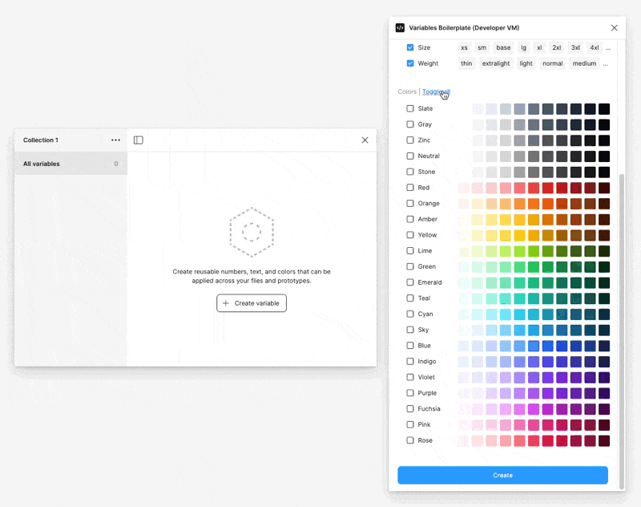

# Figma Messaging

> Messaging library for Figma plugin developers



_Example of processing spinner in [Figma Variables Starter](https://github.com/masha312/figma-variables-starter)._

## Overview

Figma Messaging is a two-way, await-able and type-safe replacement for Figma's [Messaging API](https://www.figma.com/plugin-docs/creating-ui/#sending-messages-between-the-ui-and-plugin-code).

It has a [simple but powerful](docs/README.md#usage) API and can be used in both `main` and `ui` processes:

```ts
// actions
const handlers = {
  create () { ... },
  update () { ... },
  ...
}

// incoming
const bus = makeBus(handlers)

// outgoing
bus.call('fooify', 'foo', 123, true)
```

Additionally, TypeScript users can opt-in to full [auto-complete](docs/bus.md#ide-auto-complete) functionality, including:

handler **ids**:


handler **parameters**:


handler **responses**:


Figma Messaging provides robust messaging capabilities for any [Figma Plugin](https://www.figma.com/plugin-docs/) with a build step.

## Next steps

- [Docs](./docs)
- [Demo](./demo)

