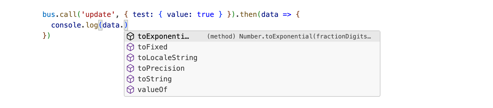

# Bus

## Overview

The Bus service is a higher-level message bus service (which wraps [IPC](ipc.md)) to provide:

- two-way communication between `main` and `ui` processes
- a formalised routing and handler setup
- IDE auto-completion of known route names and parameters
- typed parameter and return data for known routes
- flexibility to call arbitrary / unknown routes
- fallback handler for arbitrary / unknown routes

## Usage

To work with the Bus service, you'll need to import and initialise it in one or both processes.

The bones of a setup looks like this:

```ts
// sending
const bus = makeBus()

bus.call('foo', 123).then(result => {
  console.log(value)
})
```
```ts
// receiving
const bus = makeBus({
  foo (value: number) {
    return value * 2
  }
})
```

A fleshed-out version looks like this:

```ts
import { makeBus } from 'figma-messaging'

// set up handlers
function greet (handlerId: 'greet', salutation: 'hello' | 'hey' | 'yo') {
  return `${salutation} world!`
}

function update (handlerId: 'update', items: string[]) {
  return true
}

// configure the bus (optional)
const options = {
  logging: true,
  fallback (handlerId: string, ...args: any[]) {
    // throw or handle missing routes here
  },
}

// create handlers object
const handlers = {
  greet,
  update,
}

// create the bus
const bus = useBus(handlers, options)

// handle events
function onSomeEvent () {
  bus.call('some-action', 'foo', 123)
    .then(data => {
      // handle any responses here
    })
    .catch(err => {
      // catch any errors here
    })  
}
```

Note that each process can both send _and_ receive messages.

## Advanced options

### IDE auto-complete

Note that `makeBus()` is generic in order to provide IDE auto-completion:


It relies on having the types of the handlers of the _opposite_ process passed in:

```ts
const bus = makeBus<TargetHandlers>(sourceHandlers)
```

As such you should export types from each process to be consumed by the other:

```ts
// ui.tsx
function greet (handlerId: 'greet', salutation: 'hello' | 'hey' | 'yo') {
  return `${salutation} world!`
}

// ui handlers
const handlers = {
  greet,
  ...
}

// export just the type of the handlers
export UiHandlers = typeof handlers
```

```ts
// main.ts
import { makeBus } from 'figma messaging'

// import UI handlers type
import type { UiHandlers } from './ui'

// main handlers
const handlers = {
  ...
}

// create bus
const bus = makeBus<UiHandlers>(handlers) // note; the generic type must be from the OTHER process!

// call ui
bus.call('...') // should show list of handlers, their parameters, return type, etc
```

You can view the full signature of the handler (once the handler id has been typed) by hovering over the `call()` method:


On WebStorm, you may need to hold down `Cmd` (Mac) or `Ctrl` (Windows) to view the same.

Note that everything – including the return type – is type-safe:



Note that auto-complete will only show handlers included in the imported type; if you add new handlers using `bus.on(...)` these can be called, but will not show in your IDE.

### Nested routes

Currently, only a flat set of `id: function` pairs is supported (though this may change in a future version).

To simulate nested handlers, hardcode paths as handler keys:

```ts
const handlers = {
  'items/add': addItems,
  'items/update': updateItems,
}
```

### Error handling

The Bus service has built-in error handling.

Any uncaught errors thrown in the target process will be caught, serialised, sent back to the source process, and passed to the `call()` Promise's `reject` handler.

### Fallback handler

If for any reason you might need to call a route that doesn't exist, or it's too complicated to set up individual handlers, you can set up a fallback handler in the Bus options:

```ts
import { useBus } from 'figma-messaging'

const bus = useBus(handlers, {
  fallback (handlerId: string, ...args) {
    if (handlerId.startsWith('users/')) {
      // do something here
    }
    else {
      throw new Error('Missing route!')
    }
  }
})
```

## API

### Helpers

#### makeBus(handlers?, options?)

> Create a `Bus` object to send and receive messages to and from Figma Main and UI processes

Params:

- `handlers`: `Record<string, Handler>`
  An optional hash of handlers to be called from the other process
- `options`: `{ logging: boolean, fallback: MessageHandler }`
  An optional hash of options to modify the behaviour of the bus

Returns:

- A `Bus`  instance

### Classes

#### Bus

> A Bus instance

#### bus.call(handlerId, ...args)

> Call a handler in the opposite process

Params:

- `handlerId`: `string`
  The id of a handler in the opposite process
- `...args`: `any[]`
  Optional arguments to pass with the call

Returns:

- `Promise<any>`: Any value returned by the opposite process

Throws:

- Any error thrown and not caught by the opposite process

Note that you can also call unknown or untyped handlers in the opposite process if:

- A `fallback` handler was added in options
- New handlers were added using `bus.on()`

#### bus.on(handlerId, handler)

> Add one or more handlers for incoming messages

Params:

- `handlerId`: `string` | `Handlers`
  If adding a single handler, a `string` identifier for the handler. If passing multiple handlers, a hash of handler functions.
- `handler`: `Handler`
  If adding a single handler, the handler function itself

Generally you would add handlers in the creation process, but you have the option to add them on demand if you need to.

#### bus.off(handlerId)

> Remove one or more handlers for incoming messages

Params:

- `handlerId`: `string` | `true` 
  Remove a named handler (`string`) or all handlers (`true`)

## Next

Look at:

- [IPC](ipc.md)
- [Types](types.md)
